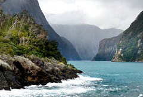
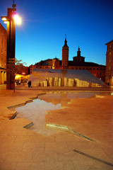

[](https://www.webcomponents.org/element/CaptainCodeman/dry-stone-layout)

_[Demo and API docs](http://captaincodeman.github.io/dry-stone-layout/)_

# \<dry-stone-layout\>

`dry-stone-layout` is a layout element that creates a masonry-like layout with no gaps
perfect for responsive image galleries. If you've ever seen dry-stone walls in the UK,
you'll understand the name.


Based on these previous ideas:
* [Algorithm for a perfectly balanced photo gallery](https://medium.com/@jtreitz/the-algorithm-for-a-perfectly-balanced-photo-gallery-914c94a5d8af#.8qss863p6)
* [Google Plus image layout algorithm](http://blog.vjeux.com/2012/image/image-layout-algorithm-google-plus.html)
* [Packing images in a grid](http://fangel.github.io/packing-images-in-a-grid/)

<!---
```
<custom-element-demo>
  <template>
    <script src="../webcomponentsjs/webcomponents-lite.js"></script>
    <link rel="import" href="dry-stone-layout.html">
    <next-code-block></next-code-block>
  </template>
</custom-element-demo>
```
-->
```html
<dry-stone-layout target-height="90" spacing="1">
  
  
  
  
  
  
  
  
  
  
  
  
  
  
  
</dry-stone-layout>
```